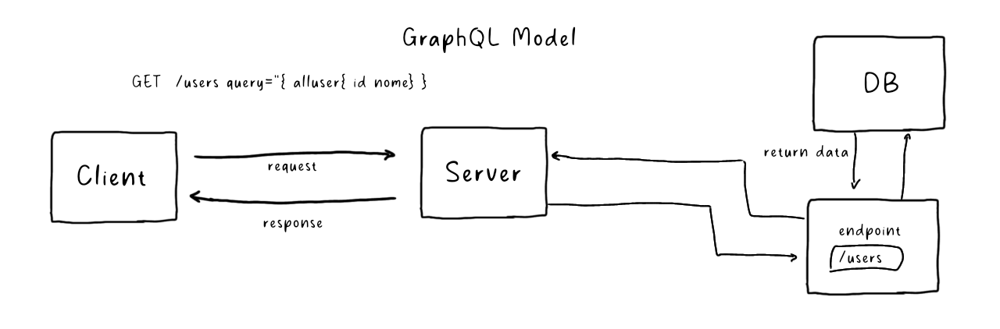

# Introdução ao GraphQL com Strawberry

## O que é GraphQL?

GraphQL é uma linguagem de consulta e ambiente de execução voltada a servidores para as interfaces de programação de aplicações (APIs) cuja prioridade é fornecer exatamente os dados que os clientes solicitam e nada além. 

O GraphQL foi desenvolvido para tornar as APIs mais rápidas, flexíveis e intuitivas para os desenvolvedores permitindo aos desenvolvedores fazer consultas que extraem os dados de várias fontes em uma única chamada de API. 

referencia; [GraphQL: linguagem de consulta para APIs](https://www.redhat.com/pt-br/topics/api/what-is-graphql)




## Problemas que o modele REST gera

O modelo REST apesar de amplamente utilizado, pode gerar desafios como overfetching, undertching, quantidade excessiva de endpoints e altos consumos de banda, esses problemas edtão relacionados com a forma como estes dados estão estruturados e como são transmitidos.

* **overfetching**: Ocorre quando a requisição retorna mais dados do que o necessário
* **underfetching**: Ocorre quando a requisição retorna menos dados do que o necessário

### caso de overfetching:

Supondo que temos uma API REST de gerenciamento de usuários que possue apenas dois endpoints, 'GET /user/ID' (para fazer a requisição de um usuário.) e o endpoint 'POST /user' (para criação de um novo usuário.)

// exemplo de estrutura de cada usuário:

```json
{
  "id": 1,
  "username": "john_doe",
  "email": "john.doe@example.com",
  "passwordHash": "$2b$12$KIXSw3yIlSowvOKcw/ZhYeg9o8KD8R3gfQP3AScPaTG74KtCkAA/m",
  "profile": {
    "firstName": "John",
    "lastName": "Doe",
    "age": 29,
    "gender": "male",
    "dateOfBirth": "1995-05-15",
    "phone": "+1-202-555-0175",
    "address": {
      "street": "123 Main St",
      "city": "New York",
      "state": "NY",
      "country": "USA"
    }
  }
}
```

O problema começa quando todos os dados de um usuário são retornados em uma requisição na qual o cliente da aplicação apenas requer dados como 'nome' e 'email'. nesse caso temos um problema de overfetching que o modelo rest propõe solucionar com a criação de mais endpoints.

por exemplo poderia ser criado os endpoints:

* GET/user-name/ID: que retorna apenas o nome do usuário.
* GET/user-email/ID: que retorna apenas o email.

Porém isso acaba gerando dois outros problemas que são a quantidade excessiva de endpoints e o chamado
underfetching que  é quando uma requisição retorna menos dados do que o esperado fazendo com que o cliente 
precise fazer duas ou mais requisições para obter os dados necessários.


## Vantagens do modelo GraphQL

As chamadas do GraphQL são processadas em uma única transmissão com ida e volta. Os clientes recebem exatamente o que solicitam, sem mais dados do que o necessário (overfetching).

exemplo de requisição: 

```curl
GET /graphql?query="{ user(id: 1){ username email } }"
```

exemplo de resposta:

```json
{
  "data": {
    "user": {
      "username": "john_doe",
      "email": "john.doe@example.com"
    }
  }
}

```